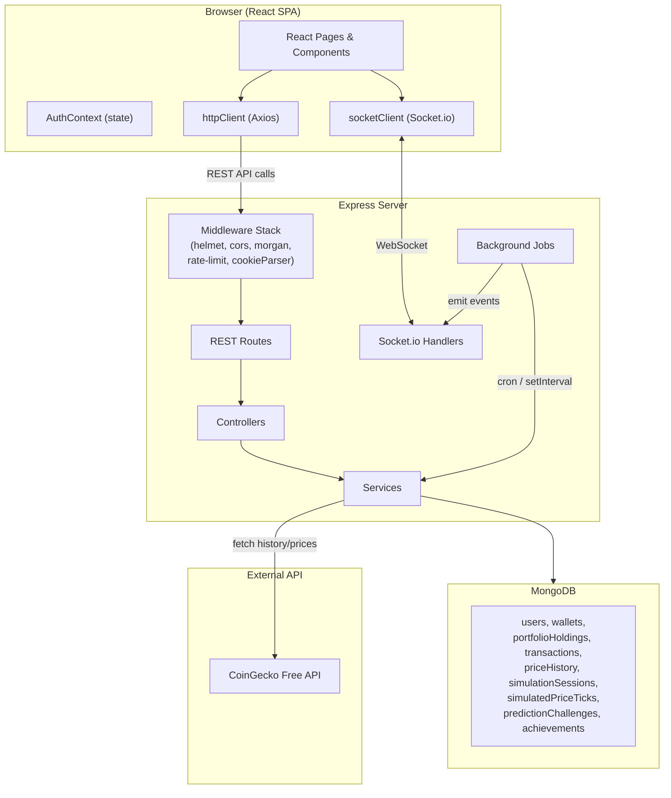
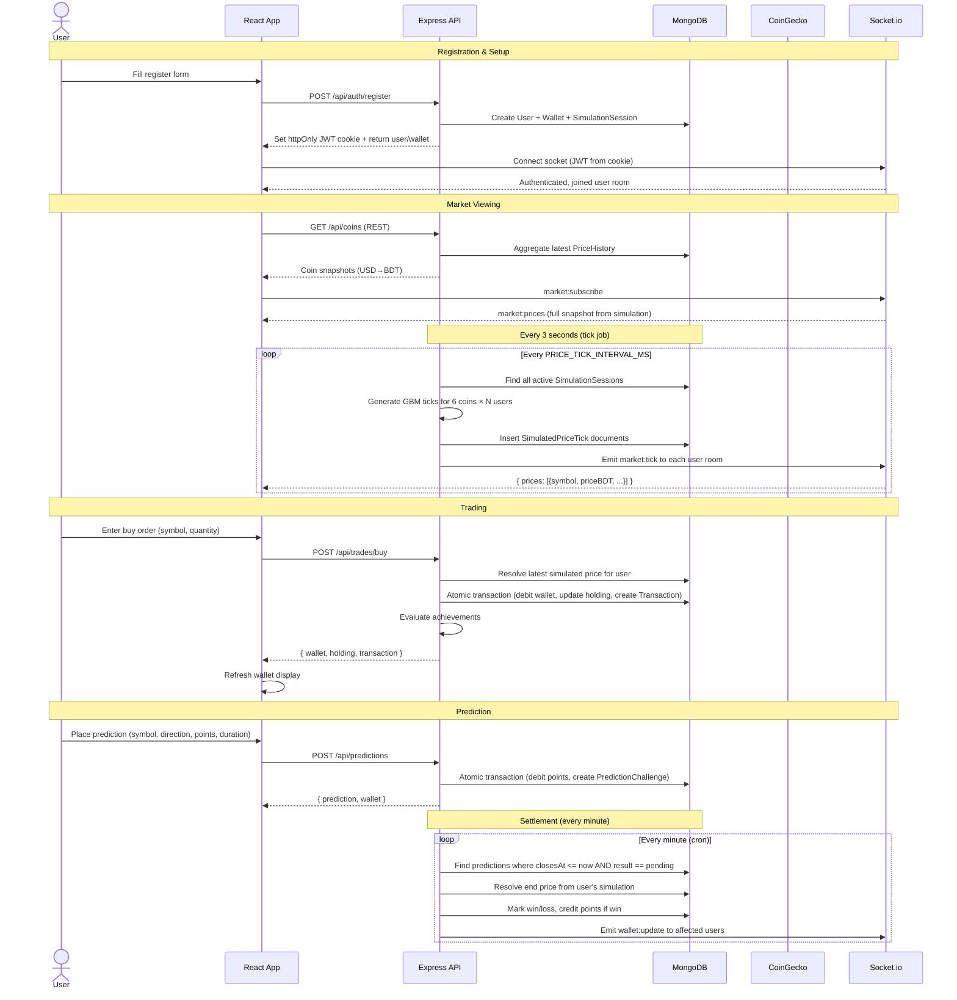
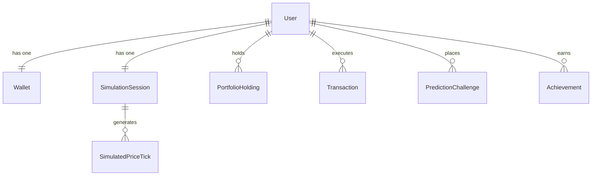
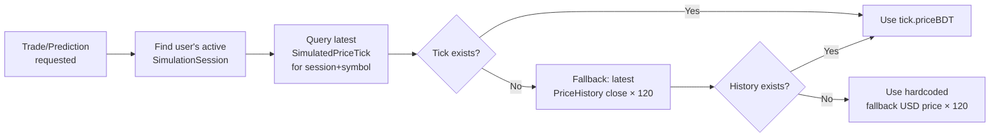
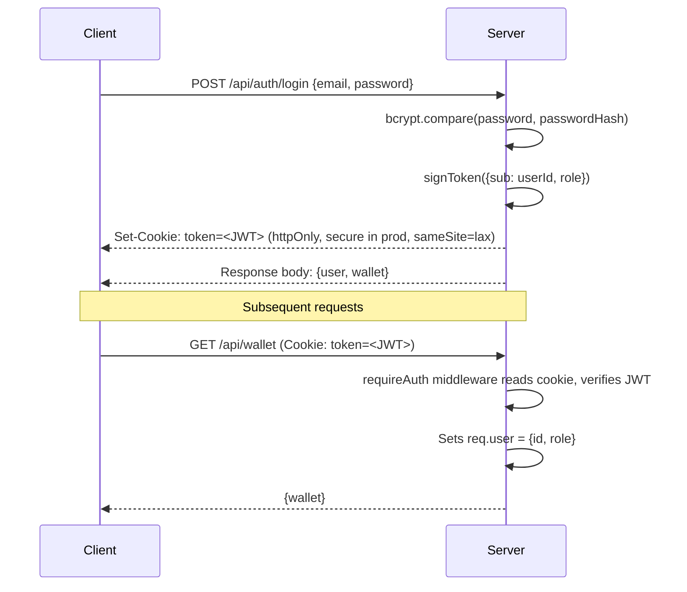

# CryptoSim — System Overview

## 1. What Is This Project?

CryptoSim is an **educational crypto trading simulator** — a full-stack web application that lets users practice cryptocurrency trading without any real money or financial risk. It was built as a web development course lab project using **React** (frontend), **Express.js** (backend), and **MongoDB/Mongoose** (database).

### The Problem It Solves

In Bangladesh, holding and using cryptocurrencies is illegal. Most people therefore have no hands-on experience with how crypto markets actually work — the volatility, the risks, the jargon. CryptoSim bridges that gap by providing a realistic, gamified simulation where users can:

- Trade 6 major cryptocurrencies (BTC, ETH, SOL, DOGE, XRP, BNB) with virtual BDT
- Experience live, per-user simulated price movements
- Learn trading concepts (market orders, portfolio management, P&L)
- Compete on a leaderboard, earn achievements, and place prediction challenges

> **Disclaimer (always displayed):** _"Educational simulator only. All balances, trades, prices, and rewards are virtual; no real cryptocurrency or financial transaction occurs."_

---

## 2. Features at a Glance

| Feature | Description |
|---|---|
| **User Registration & Login** | JWT-based auth with httpOnly cookies; password hashed with bcrypt |
| **Virtual Wallet** | Each user starts with ৳100,000 BDT + 100 virtual points |
| **Live Simulated Market** | Per-user price feeds generated via Geometric Brownian Motion, delivered over WebSocket every 3 seconds |
| **Market Buy/Sell** | Instant market orders executed atomically against the user's own simulated price (MongoDB transactions) |
| **Portfolio & P/L Tracking** | Holdings with average-cost basis, unrealized and realized profit/loss |
| **Transaction History** | Paginated log of all trades |
| **Price Charts** | Historical daily candles (from CoinGecko) + live simulation ticks, rendered with Recharts |
| **Prediction Challenges** | Stake virtual points on whether a coin's price will go up or down within a time window; auto-settled by a background job |
| **Achievements** | 7 achievements (e.g., First Trade, Active Trader, Winning Streak) auto-evaluated after trades and predictions |
| **Leaderboard** | Users ranked by portfolio return %, fair across different simulated price paths |
| **Learning Content** | Static educational lessons on crypto basics, trading mechanics, risk management |
| **Educational Disclaimer** | Persistent banner on every page |

---

## 3. Technology Stack

```
Frontend (client/)              Backend (server/)
─────────────────               ─────────────────
React 19                        Node.js + Express 5
React Router 7                  MongoDB + Mongoose 9
Tailwind CSS 4                  Socket.io 4
Recharts 3                      JWT (jsonwebtoken)
Axios                           bcryptjs
Socket.io-client                node-cron
Vite 8                          Zod (validation)
                                Helmet, CORS, morgan
                                express-rate-limit
```

---

## 4. High-Level Architecture



### How Frontend and Backend Interact

1. **REST API (HTTP):** All data-mutating operations (register, login, trade, predict) and data-fetching operations (wallet, portfolio, coins, leaderboard, achievements, learning) go through REST endpoints. The client uses an Axios instance (`httpClient`) configured with `withCredentials: true` to include the httpOnly JWT cookie on every request.

2. **WebSocket (Socket.io):** Used exclusively for real-time price delivery. After login, the client connects a Socket.io socket (also with credentials). The server authenticates the socket handshake by reading the JWT from the cookie header, then places the socket in a per-user room (`user:<userId>`). The simulation tick job generates new prices every 3 seconds and emits them to each user's room.

3. **Background Jobs:** Three jobs run server-side:
   - **Simulation Tick Job** — `setInterval` every 3s, advances all active simulation sessions
   - **Prediction Settlement Job** — `node-cron` every minute, settles due predictions
   - **Historical Refresh Job** — `node-cron` (default hourly), syncs latest prices from CoinGecko

---

## 5. User Flow — Start to Finish



---

## 6. Data Model

The database consists of 9 MongoDB collections:

| Collection | Purpose | Key Fields |
|---|---|---|
| **users** | User accounts | name, email, passwordHash (select: false), role (user/admin), difficulty (easy/medium/hard), status (active/suspended), winningStreakCount |
| **wallets** | Virtual currency balances (1:1 with user) | userId (unique), cashBalanceBDT (default 100000), virtualPoints (default 100), portfolioValueBDT |
| **simulationSessions** | Per-user simulation config (1:1 with user) | userId (unique), seed, difficulty, sourceWindow, status (active/paused/completed) |
| **simulatedPriceTicks** | Time-series of generated prices | sessionId, symbol, priceBDT, generatedAt. Indexed on `(sessionId, symbol, generatedAt)` |
| **priceHistory** | Historical OHLCV candles from CoinGecko | symbol, provider, interval, timestamp, open/high/low/close, volume, marketCap, percentChange24h. Indexed on `(symbol, interval, timestamp)` |
| **portfolioHoldings** | Coin holdings per user | userId, symbol, quantity, averageBuyPriceBDT, realizedPnlBDT. Unique index on `(userId, symbol)` |
| **transactions** | Trade execution log | userId, symbol, side (buy/sell), quantity, executionPriceBDT, feeBDT. Indexed on `(userId, createdAt)` |
| **predictionChallenges** | Price direction bets | userId, symbol, direction (up/down), pointsStaked, startPriceBDT, endPriceBDT, closesAt, result (pending/win/loss) |
| **achievements** | Unlocked milestone records | userId, code, unlockedAt. Unique index on `(userId, code)` |

### Entity Relationships



---

## 7. API Endpoints

### Authentication
| Method | Path | Auth | Purpose |
|---|---|---|---|
| POST | `/api/auth/register` | No | Create account (user + wallet + simulation session) |
| POST | `/api/auth/login` | No | Verify credentials, set JWT cookie |
| POST | `/api/auth/logout` | No | Clear JWT cookie |
| GET | `/api/auth/me` | Yes | Get current user profile |

### User & Wallet
| Method | Path | Auth | Purpose |
|---|---|---|---|
| PATCH | `/api/users/me` | Yes | Update name or difficulty |
| GET | `/api/wallet` | Yes | Get wallet balances |

### Market Data
| Method | Path | Auth | Purpose |
|---|---|---|---|
| GET | `/api/coins` | No | Latest snapshot for all 6 coins |
| GET | `/api/coins/:symbol` | No | Single coin snapshot |
| GET | `/api/coins/:symbol/history` | No | Historical candles (BDT) |
| POST | `/api/coins/refresh` | No | Manually trigger CoinGecko sync |

### Trading
| Method | Path | Auth | Purpose |
|---|---|---|---|
| POST | `/api/trades/buy` | Yes | Execute market buy |
| POST | `/api/trades/sell` | Yes | Execute market sell |
| GET | `/api/portfolio` | Yes | Holdings with live valuation |
| GET | `/api/transactions` | Yes | Paginated trade history |

### Gamification
| Method | Path | Auth | Purpose |
|---|---|---|---|
| POST | `/api/predictions` | Yes | Place a prediction challenge |
| GET | `/api/predictions/history` | Yes | Paginated prediction history |
| GET | `/api/leaderboard` | Yes | Users ranked by return % |
| GET | `/api/achievements` | Yes | Achievement definitions + unlock status |
| GET | `/api/learning` | No | Static educational lessons |

### WebSocket Events
| Direction | Event | Payload | Purpose |
|---|---|---|---|
| Client → Server | `market:subscribe` | — | Request initial price snapshot |
| Client → Server | `market:unsubscribe` | — | No-op (room stays active) |
| Server → Client | `market:prices` | `{ prices: [...] }` | Full snapshot on subscribe |
| Server → Client | `market:tick` | `{ prices: [...] }` | Incremental tick every 3s |
| Server → Client | `wallet:update` | `{ userId }` | Signal client to refresh wallet |

---

## 8. The Simulation Engine — How Prices Work

This is the core of what makes CryptoSim unique. Each user gets their **own independent simulated price path**, generated deterministically from a unique seed.

### How It Works

1. **Anchor Price:** The simulation starts from the latest real price fetched from CoinGecko (stored in `PriceHistory`). This USD price is converted to BDT using a fixed rate of `BDT_PER_USD = 120`.

2. **Geometric Brownian Motion (GBM):** Each tick advances the price using:
   ```
   S(t+1) = S(t) × exp(drift + volatility × Z)
   ```
   where `Z` is a standard normal sample generated from a **seeded hash** (SHA-256), making the path deterministic for a given seed.

3. **Difficulty Presets:** The volatility and drift parameters depend on the session difficulty:
   | Difficulty | Volatility | Drift |
   |---|---|---|
   | beginner | 0.0025 | 0.00005 |
   | intermediate | 0.006 | 0.0001 |
   | expert | 0.012 | 0.00015 |

4. **Continuous Advancement:** The tick job runs on a `setInterval` (default 3000ms). It finds all active simulation sessions, generates new ticks for all 6 symbols in parallel, persists them to `SimulatedPriceTick`, and emits them via Socket.io.

5. **Per-User Isolation:** Each user's trades, displayed prices, and prediction outcomes are all resolved against **their own simulated price path** — never a shared/global price. The leaderboard stays fair by ranking on portfolio return percentage relative to each user's own ৳100,000 starting balance.

### Price Resolution Chain



---

## 9. Third-Party API Integration — CoinGecko

CoinGecko's **free API** is used as the source of real-world historical price data. The integration is designed with a **provider-agnostic adapter pattern** so CoinGecko can be swapped out later without changing any caller.

### Architecture

```
adapter.js (abstract MarketDataAdapter class)
    ↑ extends
coinGeckoProvider.js (CoinGeckoProvider singleton)
```

### Two API Endpoints Used

1. **Simple Price** (`/api/v3/simple/price`): Fetches the latest USD price, market cap, 24h volume, and 24h change for all 6 coins in one request.

2. **OHLC** (`/api/v3/coins/{id}/ohlc`): Fetches historical OHLCV candle data. Used by the seed script and the historical refresh job.

### Symbol Mapping

| App Symbol | CoinGecko ID |
|---|---|
| BTC | bitcoin |
| ETH | ethereum |
| SOL | solana |
| DOGE | dogecoin |
| XRP | ripple |
| BNB | binancecoin |

### When CoinGecko Is Called

- **Seed Script** (`npm run seed:history`): One-off script that fetches 30 days of OHLC data for all 6 coins and inserts into `PriceHistory`. Includes 2-second delays between symbols to avoid rate limiting.
- **Historical Refresh Job**: Cron job (default hourly) that calls `syncLatestPrices()` — fetches latest snapshot prices and OHLC data, then inserts new `PriceHistory` records.
- **On-Demand Fallback**: If `GET /api/coins` finds no prices in the database, it triggers `syncLatestPrices()` automatically.

---

## 10. Authentication & Security

### JWT Cookie Flow



### Security Measures

- **httpOnly cookies** — JWT never exposed to JavaScript
- **Helmet** — sets security headers (CSP, X-Frame-Options, etc.)
- **CORS** — restricted to `CLIENT_ORIGIN`
- **Rate limiting** — 300 requests per 15 minutes per IP
- **Password hashing** — bcrypt with 10 salt rounds
- **`passwordHash` hidden by default** — Mongoose `select: false` on the field
- **Zod-validated environment** — server won't start with missing/invalid env vars
- **MongoDB transactions** — atomic wallet+holding updates prevent race conditions

---

## 11. Background Jobs

| Job | Trigger | What It Does |
|---|---|---|
| **simulationTickJob** | `setInterval` (default 3000ms) | Finds all active sessions → generates GBM ticks for all 6 coins per session → persists `SimulatedPriceTick` documents → emits `market:tick` events via Socket.io |
| **predictionSettlementJob** | `node-cron` every minute | Finds `PredictionChallenge` docs where `closesAt <= now` and `result == 'pending'` → resolves end price from user's simulation → marks win/loss → credits points if win → evaluates achievements → emits `wallet:update` |
| **historicalRefreshJob** | `node-cron` (default `0 * * * *` = hourly) | Calls `syncLatestPrices()` to fetch fresh data from CoinGecko and insert into `PriceHistory` |

---

## 12. Achievement System

Achievements are automatically evaluated after every trade and prediction. The evaluation is fire-and-forget — failures never break the triggering action.

| Code | Title | Trigger |
|---|---|---|
| `FIRST_TRADE` | First Trade | ≥1 transaction |
| `FIVE_TRADES` | Active Trader | ≥5 transactions |
| `FIRST_PREDICTION` | Fortune Teller | ≥1 prediction challenge |
| `PREDICTION_WINNER` | Called It | ≥1 winning prediction |
| `FIVE_WINS` | Market Oracle | ≥5 winning predictions |
| `WALLET_MILESTONE` | Doubled Up | Cash balance ≥ ৳200,000 |
| `WINNING_STREAK` | Winning Streak | ≥5 consecutive profitable sells (tracked via `user.winningStreakCount`) |

---

## 13. Environment Variables

### Server (`server/.env`)
| Variable | Purpose | Default |
|---|---|---|
| `NODE_ENV` | Environment mode | `development` |
| `PORT` | Server port | `10000` |
| `MONGODB_URI` | MongoDB connection string | (required) |
| `JWT_SECRET` | JWT signing secret | (required) |
| `JWT_EXPIRES_IN` | Token lifetime | `7d` |
| `CLIENT_ORIGIN` | Allowed CORS origin | `http://localhost:5173` |
| `MARKET_DATA_PROVIDER` | Market data source | (optional) |
| `MARKET_DATA_API_KEY` | API key for market data | (optional) |
| `PRICE_TICK_INTERVAL_MS` | Simulation tick interval | `3000` |
| `HISTORICAL_REFRESH_CRON` | Cron expression for historical refresh | (optional, defaults to hourly) |

### Client (`client/.env`)
| Variable | Purpose | Default |
|---|---|---|
| `VITE_API_BASE_URL` | Backend API base URL | `""` (uses Vite proxy) |
| `VITE_SOCKET_URL` | Socket.io server URL | `""` (uses Vite proxy) |

---

## 14. Development Setup

The client and server are independently deployable with separate `package.json` files.

### Running Locally

```bash
# Terminal 1 — Server
cd server
cp .env.example .env   # fill in MONGODB_URI, JWT_SECRET
npm install
npm run seed:history    # optional: seed CoinGecko data
npm run dev             # starts on port 10000

# Terminal 2 — Client
cd client
cp .env.example .env
npm install
npm run dev             # starts on port 5173, proxies /api + /socket.io to :10000
```

### Vite Proxy

The client's `vite.config.js` proxies:
- `/api/*` → `http://localhost:10000`
- `/socket.io/*` → `http://localhost:10000` (WebSocket)

This means during development, the client makes requests to its own origin (`:5173`) and Vite forwards them to the Express server. In production, `VITE_API_BASE_URL` and `VITE_SOCKET_URL` point to the deployed server.

---

## 15. Repository Layout

```
WEB_DEVELOPMENT/
├── client/                          # React frontend (Vite)
│   ├── src/
│   │   ├── App.jsx                  # Route definitions
│   │   ├── main.jsx                 # Entry point (BrowserRouter)
│   │   ├── index.css                # Global styles + Tailwind import
│   │   ├── components/              # Reusable UI components
│   │   ├── features/auth/           # AuthContext (state management)
│   │   ├── hooks/                   # Custom React hooks
│   │   ├── layouts/                 # Page layouts (RootLayout)
│   │   ├── lib/                     # Shared constants
│   │   ├── pages/                   # Route page components (11 pages)
│   │   └── services/               # API client modules (8 services)
│   ├── vite.config.js
│   └── package.json
├── server/                          # Express backend
│   ├── src/
│   │   ├── index.js                 # Server entry + Socket.io setup + job startup
│   │   ├── app.js                   # Express app factory
│   │   ├── config/                  # env.js (Zod schema), db.js (Mongoose connect)
│   │   ├── constants/               # SUPPORTED_SYMBOLS, error codes, disclaimer
│   │   ├── controllers/            # Route handlers (11 controllers)
│   │   ├── data/                    # Static data (learningContent)
│   │   ├── jobs/                    # Background jobs (3 jobs)
│   │   ├── middlewares/             # auth.js (requireAuth)
│   │   ├── models/                  # Mongoose schemas (9 models)
│   │   ├── routes/                  # Express routers (11 route files)
│   │   ├── scripts/                 # One-off scripts (seedHistory)
│   │   ├── services/               # Business logic (7 services + 2 subdirs)
│   │   │   ├── marketData/          # adapter.js + coinGeckoProvider.js
│   │   │   └── simulation/          # engine.js (GBM simulation)
│   │   ├── socket/                  # marketSocket.js (Socket.io handlers)
│   │   └── utils/                   # AppError, asyncHandler, jwt, parseDuration, toPublicUser
│   └── package.json
├── docs/                            # Documentation (this directory)
├── plan.md                          # Implementation plan
└── context.md                       # Project context
```
